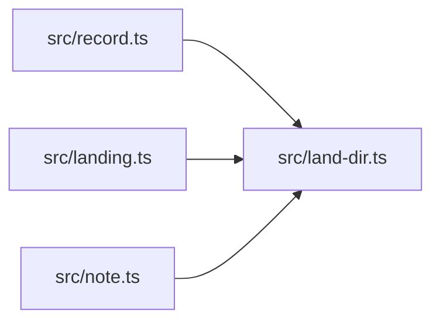

The `.land` folder and the step that hides it from git now live in one module, `src/land-dir.ts`, so `land record`, the note and the landing no longer reach into each other for it.

```mermaid
graph LR
  record[src/record.ts] --> dir[src/land-dir.ts]
  landing[src/landing.ts] --> dir
  note[src/note.ts] --> dir
```
